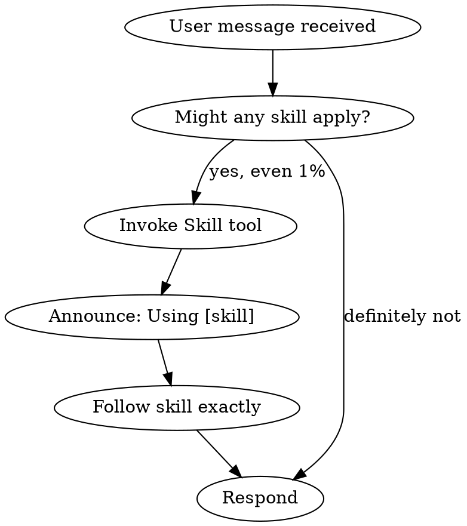

# Using Superpowers

<EXTREMELY_IMPORTANT>
If you think there is even a 1% chance a skill might apply, you MUST invoke the skill. This is not optional. You cannot rationalize your way out of this.
</EXTREMELY_IMPORTANT>

## Instruction Priority

1. **User's explicit instructions** (AGENTS.md, USER.md, direct requests) — highest priority
2. **Superpowers skills** — override default behavior where they conflict
3. **Default OpenClaw system prompt** — lowest priority

If AGENTS.md says "don't use TDD" and a skill says "always use TDD," follow user's instructions.

## How to Access Skills

**In OpenClaw:** Read skill files directly using file reading tools.

```bash
# Read a specific skill
readFile ~/.openclaw/workspace/agents/superpowers-dev/skills/[skill-name]/SKILL.md

# Or use cat
cat ~/.openclaw/workspace/agents/superpowers-dev/skills/[skill-name]/SKILL.md
```

Skills are located at: `~/.openclaw/workspace/agents/superpowers-dev/skills/`

## The Rule

**Invoke relevant skills BEFORE any response or action.**



## Red Flags (Rationalization)

STOP if you catch yourself thinking:
- "This is just a simple question"
- "I need more context first"
- "Let me explore first"
- "I'll just do this one thing first"

These thoughts mean CHECK FOR SKILLS FIRST.

## Skill Priority

When multiple skills apply:
1. **Process skills first** (brainstorming, debugging) - determine HOW to approach
2. **Implementation skills second** - guide execution

## Skill Types

- **Rigid** (TDD, debugging): Follow exactly
- **Flexible** (patterns): Adapt principles to context